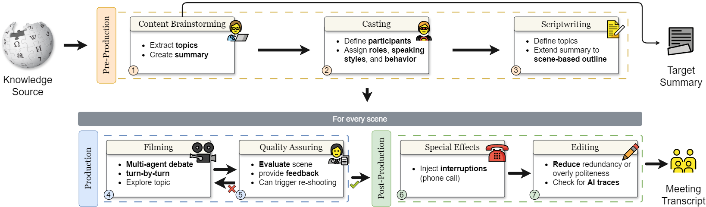
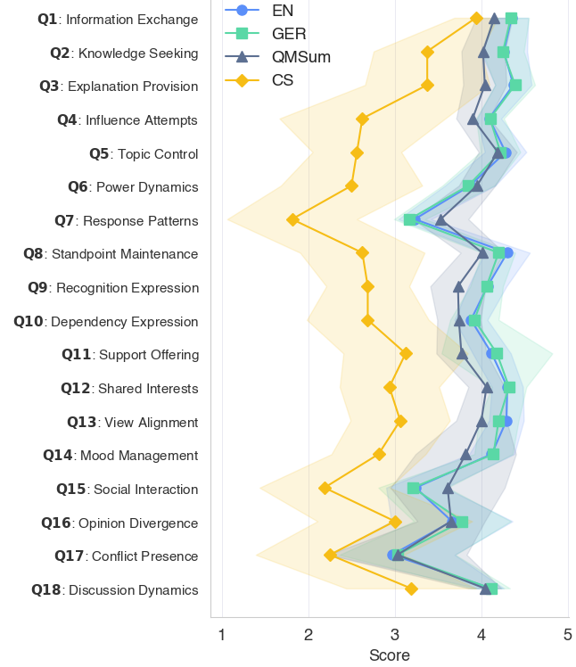

# You need to MIMIC to get FAME: Solving Meeting Transcript Scarcity with a Multi-Agent Conversations
This software project accompanies the research paper, [You need to MIMIC to get FAME: Solving Meeting Transcript Scarcity with a Multi-Agent Conversations](https://aclanthology.org/2025.findings-acl.599/). **This paper has been accepted to ACL 2025 Findings.**


<p align="center">
  
</p>

## 🎯 The Challenge

Meeting summarization research suffers from severe data scarcity:
- **Privacy concerns** limit real meeting data collection
- **Existing datasets** (AMI, ICSI, QMSum) cover narrow scenarios
- **Non-English resources** are extremely rare
- **Current synthetic methods** fail to capture authentic group dynamics

## 🎬 Our Solution: MIMIC Framework

MIMIC (Multi-agent IMItation of Conversations) is a movie-production-inspired framework that orchestrates psychologically grounded LLM agents to generate realistic meeting transcripts.

### Key Features
- **7-stage pipeline**: Pre-production → Production → Post-production
- **Psychology-based agents**: Each participant has unique behaviors, expertise, and speaking styles
- **Non-omniscient design**: Agents only know their assigned knowledge portions
- **Dynamic interactions**: Natural interruptions, topic evolution, and role changes


## 📊 FAME Dataset

Generated using MIMIC, FAME (FAke MEetings) provides:
- **800 meetings** (500 English, 300 German)
- **14 meeting types** (brainstorming, decision-making, strategic planning, etc.)
- **28 topic domains** from Wikipedia
- **3,200+ unique participants** with psychological profiles
- **Quality annotations** for authenticity and difficulty

## 🔬 Key Results

### Meeting Authenticity

<div align="center">

| Metric | FAME-EN | FAME-DE | AMI | ICSI | WPCP | QMSum |
|:------:|:-------:|:-------:|:---:|:----:|:----:|:-----:|
| **Coherence** | 4.5±0.00 | 4.5±0.18 | 4.5±0.36 | 3.5±0.36 | 4.5±0.00 | 4.5±0.73 |
| **Consistency** | 4.5±0.07 | 4.5±0.09 | 4.5±0.68 | 3.5±0.87 | 4.5±0.38 | 4±0.59 |
| **Interestingness** | 4.5±0.13 | 4.5±0.23 | 4±0.68 | 3±0.87 | 4±0.38 | 4±0.77 |
| **Naturalness** | 4.5±0.12 | 4±1.37 | 4.5±0.55 | 4.5±0.82 | 5±0.00 | 4.5±0.90 |

*Values are Median±Std on a 1-5 scale. Higher is better.*

</div>

- **Naturalness**: 4.5/5 (matches real meetings)
- **Behavioral authenticity**: Closely aligns with human expectations
- **Information density**: Captures real meeting challenges

### Transcript Challenges

<div align="center">

| Challenge | FAME-EN | FAME-DE | QMSum | AMI | ICSI |
|:---------|:-------:|:-------:|:-----:|:---:|:----:|
| **Spoken language** | 3±0.49 | 3±0.54 | 3±1.35 | 4±0.22 | 3±0.70 |
| **Speaker dynamics** | 2±0.62 | 2±0.73 | 3±0.91 | 4±0.66 | 3±0.70 |
| **Coreference** | 2±0.74 | 3±0.80 | 2±0.90 | 2±0.76 | 2±1.07 |
| **Implicit context** | 4±0.16 | 4±0.18 | 0±0.85 | 0±0.00 | 2±0.97 |
| **Information density** | 4±0.27 | 4±0.00 | 2.5±0.88 | 3±0.55 | 2±0.57 |

*Values are Median±Std on a 1-5 scale. Higher indicates more difficulty.*

</div>

### Model Performance on FAME

<div align="center">

| Model | R-1 | R-2 | R-L | BERTScore | Omission | Hallucination |
|:------|:---:|:---:|:---:|:---------:|:--------:|:-------------:|
| **GPT-4o** | 39.68±5.73 | 8.43±3.45 | 29.98±4.88 | 63.80±3.11 | 4±0.16 | 4±0.98 |
| **Gemini 1.5** | 38.82±5.79 | 8.96±3.50 | 27.81±4.18 | 63.66±2.49 | 4±0.31 | 4±1.40 |
| **DeepSeek-R1** | 33.18±7.38 | 8.07±3.33 | 23.16±5.98 | 63.16±3.37 | 4±0.48 | 4±1.81 |
| **Llama 3.3** | 40.35±5.46 | 8.62±3.18 | 29.45±3.67 | 63.53±2.72 | 4±0.31 | 4±1.02 |

*ROUGE scores (0-100), MESA scores (1-5 Likert). For MESA, lower is better.*

</div>

- FAME reveals persistent LLM context-handling issues
- Omission errors increase from 3/5 (QMSum) to 4/5 (FAME)
- Fine-tuning on FAME improves real meeting summarization


### Behavioral Pattern
Evaluation of the social behavior in the meetings shows that FAME aligns closely with both QMSum and crowdsourced baselines.


<p align="center">
  
</p>

## 🚀 Quick Start

```bash
# Clone the repository
git clone https://github.com/FKIRSTE/acl2025-mimic-to-get-fame.git
cd acl2025-mimic-to-get-fame

# Install dependencies
pip install -r requirements.txt

# Generate meetings on a specific domain (optional)
python generate_eng.py --domains "Scientific Topics"

```

## 📁 Repository Structure
```
fame_dataset/
├── English/                  # English meeting transcripts (multiple types, domains, topics)
│   └── scenes_evolution/     # Scene evolution data
├── German/                   # German meeting transcripts (multiple types, domains, topics)
│   └── scenes_evolution/     # Scene evolution data
├── schema/                   # Meeting schema (JSON)
│   └── meeting_schema.json
│
README_DATASET.md             # Dataset documentation
DATA_ACCESS.md                # Data access instructions
metadata.yaml                 # Metadata for dataset

mimic_pipeline/
├── __init__.py
├── config_gpt.json           # LLM configuration
├── generator.py              # Main generator
├── generator_eng.py          # English generator
├── generator_de.py           # German generator
├── requirements.txt
├── basics/                   # Core pipeline scripts
│   ├── __init__.py
│   ├── main.py
│   ├── script_multiagent_discussion.py
│   └── scripts/
├── misc/                     # Evaluation and aggregation scripts
│   ├── agg_meetings_and_metrics.py
│   ├── compute_meeting_stats.py
│   ├── evaluate_meeting_challenges.py
│   ├── ngram_overlap.py
│   ├── noises.py
│   ├── sstories.csv
│   ├── summary_assessment.py
│   ├── test_evaluations.py
│   ├── test_meeting.py
│   ├── test_noises.py
│   └── pmc_articles_md_txt/
├── output/                   # Generated corpora will go here
│   └── final_corpora/
├── pipeline/                 # Meeting generation and evaluation modules
│   ├── __init__.py
│   ├── discussion_protocol.py
│   ├── meeting_evaluator.py
│   ├── meeting_generator.py
│   ├── meeting_plan_generator.py
│   ├── save_content.py
│   ├── summary_generator.py
│   ├── wiki_articles_de.json
│   ├── wiki_articles_eng.json
│   ├── wiki_reader.py
│   └── wikiscrape.py
```

## 🎭 Example: From Wikipedia to Meeting
<details><summary>Click to see how "Pandemics" article becomes a meeting</summary>

**Input**: Wikipedia article on Pandemics
**Stage 1-3**: Extract topics → Cast participants → Create agenda
**Stage 4**: Multi-agent conversation

```
»Virologist: According to the latest research, CEPI's initiative to condense vaccine
development timelines to 100 days is groundbreaking! However, we need a comprehensive
approach beyond rapid vaccine development.

»Public Health Policy Maker: Absolutely! We must ensure diagnostics and therapies are
available during vaccine rollout...
````

**Stage 5-7**: Quality assurance → Special effects → Final polish
</details>


## 📝 Citation
```
bibtex@inproceedings{kirstein-etal-2025-need,
  title={You need to MIMIC to get FAME: Solving Meeting Transcript Scarcity with Multi-Agent Conversations},
  author={Kirstein, Frederic and Khan, Muneeb and Wahle, Jan Philip and Ruas, Terry and Gipp, Bela},
  booktitle={Findings of the Association for Computational Linguistics: ACL 2025},
  pages={11482--11525},
  year={2025},
  address={Vienna, Austria},
  publisher={Association for Computational Linguistics}
}
````

<p align="center">
  <b>Questions?</b> Open an issue or contact <a href="mailto:kirstein@gipplab.org">kirstein@gipplab.org</a>
</p>